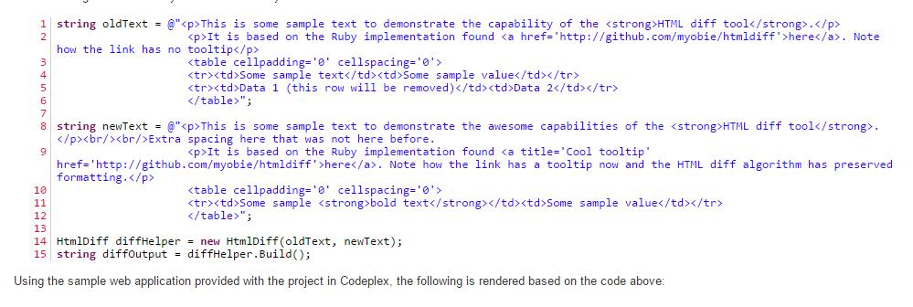
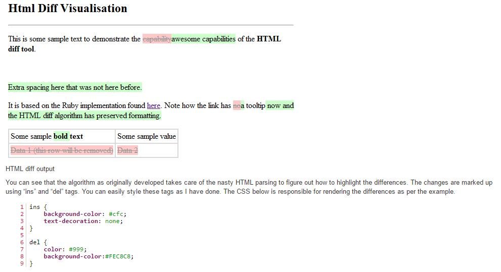

# Html Diff algorithm for .NET  

## [github repo](https://github.com/Rohland/htmldiff.net)

## [有道云js文件](htmldiff.js)

#Project Description

A library for comparing two HTML files/snippets and highlighting the differences using simple HTML.

This HTML Diff implementation is a C# port of the ruby implementation found [here](https://github.com/myobie/htmldiff).

# Usage

[Grab the latest stable version from Nuget]( https://www.nuget.org/packages/htmldiff.net/)

I have put together a blog post covering how to use the library. A simple demo is included with the solution.

[How to use HTML-DIff](http://www.rohland.co.za/index.php/2009/10/31/csharp-html-diff-algorithm/)

