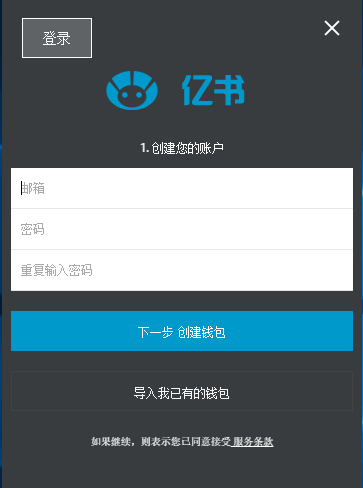
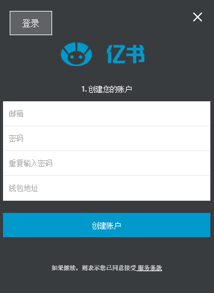
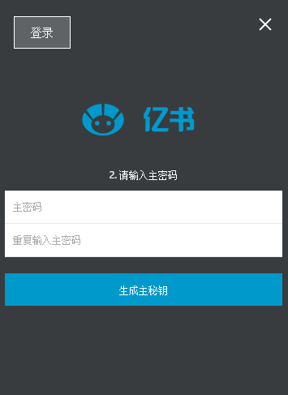
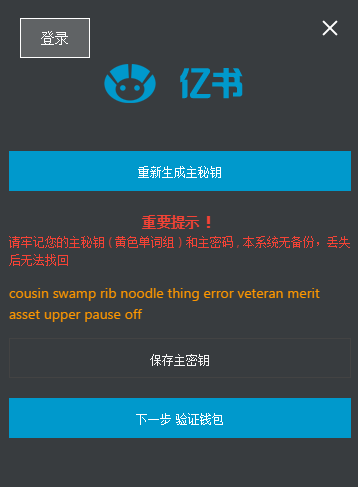
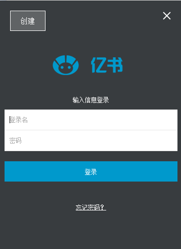
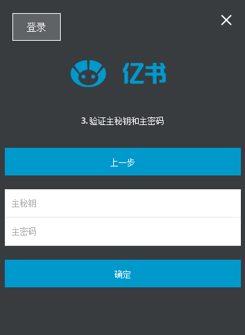

## 注册/登入

### 注册 
 - 创建钱包:  输入主秘钥，主密码   生成地址
 - 创建账户:  输入用户名，密码， 绑定地址

### 登入 
 - 登入账户   输入用户名，密码，获得账户和地址信息
 - 导入钱包   获得主秘钥信息

### 交易
 - 输入主密码
 - 生成原生秘钥传给区块链后台

### 1.注册页

### 2.我已有钱包，直接输入地址绑定注册账户，创建后会发送激活邮件

### 3.无钱包，创建钱包，用主密码生成主秘钥

### 4. 记下主秘钥，去验证钱包，或者重新生成主秘钥

### 5. 验证钱包，点击确定，验证成功，账户创建完成，发送激活邮件

### 6.登入

# 版权证明流程：

## 1. 内容自动保存,
	设置定时器，写作是系统每10s进行内容检查，若无更改，不做处理
	若有更改，将内容及当前信息保存为最新版并生成版本hash（内容一致，生成的hash值也是一致的），
	然后将该版本内容及信息保存到当前note的history对象数组中，

## 2.同步，
	每隔1分钟/或点击同步按钮，进行一次同步，将最新版本和历史版本都同步到服务器中保存，

## 3.点击右上角的R标签，打开版权注册页面
	获取当前note信息以及当前节点缓存历史信息，
	并将最新版文章内容和所有版本的hash列表呈现在界面中
	进入版权注册页面时，默认显示最新版本内容，和所有版本的列表

###	点击版权注册按钮
	    点击版权注册按钮, 打开密码输入界面，
	    自动将当前note的历史版本hash作为树的叶子，生成merkle树，并获得树根(即版权ID)
	    只要拥有同样的写作历史记录，那生成的版权ID就是不变的
	    
	    输入密码点击确定后，发起交易，
    	交易被确认后，交易信息显示为已交易并将交易记录，时间戳，版权信息写入区块链中，

### 版权追踪
		在分享和交易的过程中都会携带版权信息
		通过版权ID可以查询该文章被引用分享的链接，交易历史记录等，
		还可以查看该版权的状态，版券相关信息

### 版权追溯
	    通过版权ID可以查询该版权在区块链中的记录时间，所在区块等信息
	    当需要查看历史记录时，通过作者的授权之后可以查看服务器中保存的历史记录，
	    点击播放按钮，内容区域以10帧/s的速度进行写作历史回放，像放电影一样
	    并且可以通过这份保存的历史记录按之前的流程重新生成版权ID，若与区块链中ID一致，代表这个历史版本为真实版本

